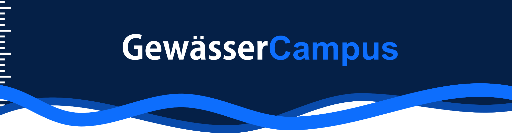

<br>
<br>

[](https://github.com/desklab/gcampus/actions/workflows/test.yml)
[](https://gcampus.readthedocs.io/en/latest/?badge=latest)
[](https://hosted.weblate.org/engage/gcampus/)
[](https://dev.gewaessercampus.de/)

**GewässerCampus** (`gcampus`) is part of an educational project on
Limnology aiming to provide students the possibility to analyse, publish
and discuss results of self-conducted measurements of water-quality in
rivers and lakes. It is developed by [desklab](www.desk-lab.de) in
cooperation with the [TU Kaiserslautern](https://www.mv.uni-kl.de/biovt/)
and funded by the [DBU](https://www.dbu.de/).
See [gewaessercampus.de](https://gewaessercampus.de) for more information.


<hr>

<h1 align="center" style="text-align: center; font-size: 28px;"> gcampus </h1>


This repository (`desklab/gcampus`) contains the source code running behind the
*GewässerCampus* web-application.
The [landingpage](https://gewaessercampus.de) is developed in
[`desklab/gcampus-landingpage`](https://github.com/desklab/gcampus-landingpage).


## Contribution

Contributions in the form of reporting issues or submitting pull
requests are welcome! Please use the available tools as described here
to ensure your changes of the code could be merged. As this project
addresses primarily a special group of users (students/teachers) and
must retain compatibility to the software and devices developed by
desklab (some of which may not be public yet), there may be some
additional requirements, which can not be covered by automated tests.
Therefore you should not hesitate to contact us via orga@desk-lab.de or
by opening an issue, if you are planning to contribute to this project,
such that we could discuss the best way to go forward. Submitted code
changes are understood to be under the same license that covers the
project.

## Development

More information can be found in the
[**technical documentation**](https://gcampus.readthedocs.io/en/latest/).

There are mainly two aspects to developing `gcampus`.
There is 

 1. the **django python backend** and 
 2. static files like **JavaScript** or **stylesheets**. 

The basic requirements for running `gcampus` are:

 - [ ] Python 3.8 or newer
 - [ ] PostgreSQL with PostGIS (serves as a database)
 - [ ] Redis (used for Celery tasks)
 - [ ] `libgdal` (required for GeoDjango)
 - [ ] Node.js and `npm` (for static files)

### General Setup

As we use the GeoDjango extension for Django, a few extra things are
needed. Geospatial data can not be stored in any old SQLite database
but requires e.g. PostGIS. Additionally, GDAL is required. The easiest
and recommended solution for all this is to use `conda` as a Python
environment. You can install any `conda` distribution you like, but
[Miniconda](https://docs.conda.io/en/latest/miniconda.html) is
recommended for a small footprint.

Create a new Python environment:
```shell
conda create -n gcampus python=3
```

Later, this environment can be activated with `conda activate gcampus`.
It should be indicated by *`(gcampus)`*  at the beginning of your
terminal prompt. Note that PyCharm also integrates nicely with `conda`.

Python packages can be easily installed using `pip`:
```shell
pip install -r requirements.txt
# Optional (e.g. for black)
pip install -r requirements-dev.txt
```

To install GDAL, run the following command:

```shell
conda install -c conda-forge libgdal
```

#### WeasyPrint

[WeasyPrint](https://doc.courtbouillon.org/weasyprint/stable/index.html)
is used to generate PDF documents e.g. for the token list. Install
instructions can be found in
[WeasyPrint's documentation](https://doc.courtbouillon.org/weasyprint/stable/first_steps.html#installation).


### Static Files (JavaScript, Stylesheets)

Make sure you have **Node.js** installed. We use `webpack` to build
stylesheets and bundle JavaScript. 

```bash
npm install -g webpack-cli
npm install

npm run dev
```

### Setup Services with `docker-compose`

A `docker-compose.yml` file is provided to easily get a PostGIS and
Redis instance up and running.
As we are using GeoDjango, PostGIS is required. Redis is used for the
Celery task queue.

```shell
docker volume create gcampus-data

docker-compose up -d
```

You can check the current status using `docker-compose ps`. The
PostgreSQL with PostGIS should be up and running at port *`5432`*.

### Running the development server

Before you can run the development server, make sure all migrations have
been applied by running

```shell
python manage.py migrate
```

Always make sure to apply migrations and check after pulling from git
if there are new migrations.

You can load a predefined fixture called `fixture.json` that already
includes some dummy fields and an admin user with the username admin
and password `admin`:
```shell
python manage.py loaddata fixture.json
```

Finally, you can run the development server:
```shell
python manage.py runserver
```

### Running a Celery worker

Celery is used to process tasks such as document generation. You can
run a worker using the `celery` command:

```shell
celery --app=gcampus.tasks worker -l INFO
```

Change `-l INFO` to an appropriate log level of your liking.

### Tests

Testing can be done using django's built in test command:

```shell
python manage.py test
```

Support for [`coverage.py`](https://coverage.readthedocs.io/) is provided
through the configuration in the `pyproject.toml` file. You can run the
tests and get the results using the following commands:

```shell
coverage run
# Preview coverage results:
coverage report
```

## Deploy

A ``Dockerfile`` is provided to easily build `gcampus` for production
usage. Note that this Dockerfile only runs a `gunicorn` server to serve
the django backend. Static files need to be served separately. In
production, this is done by using a S3 compatible object storage.


## License

**GewässerCampus** (`gcampus`) is licensed under the Affero General
Public License (AGPL) version 3. Its terms and conditions can be found
in the `LICENSE` file.
