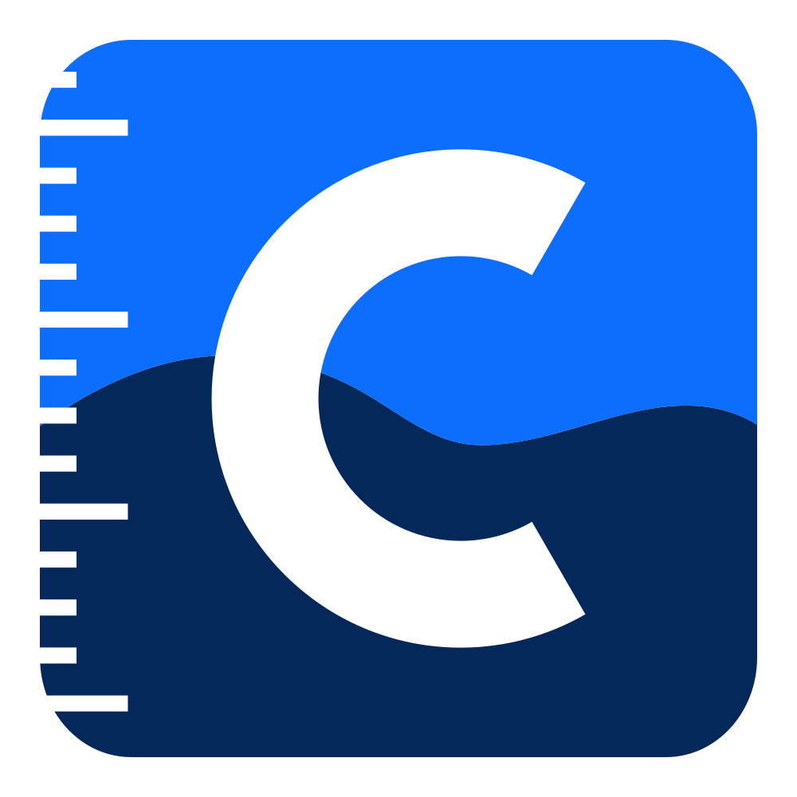

 
 

**GewässerCampus** (`gcampus`) is part of an educational project on
Limnology aiming to provide students the possibility to analyse, publish
and discuss results of self-conducted measurements of water-quality in
rivers and lakes. It is developed by [desklab](https://www.desk-lab.de) in
cooperation with the [RPTU](https://www.mv.uni-kl.de/biovt/)
and funded by the [DBU](https://www.dbu.de/).
See [gewaessercampus.de](https://gewaessercampus.de) for more information.

This repository (`desklab/gcampus`) contains the source code running behind the
*GewässerCampus* web-application.
The [website](https://gewaessercampus.de) is developed in
[`desklab/gcampus-website`](https://github.com/desklab/gcampus-website).

## Contribution

Contributions in the form of reporting issues or submitting pull
requests are welcome! Please use the available tools as described here
to ensure your changes of the code could be merged. As this project
addresses primarily a special group of users (students/teachers) and
must retain compatibility to the software and devices developed by
desklab (some of which may not be public yet), there may be some
additional requirements, which can not be covered by automated tests.
Therefore you should not hesitate to contact us via orga@desk-lab.de or
by opening an issue, if you are planning to contribute to this project,
such that we could discuss the best way to go forward. Submitted code
changes are understood to be under the same license that covers the
project.

## Development

Please refer to the [**technical documentation**](https://gcampus.readthedocs.io/en/latest/)
for a guide on how to get started with developing `gcampus`.

## License

**GewässerCampus** (`gcampus`) is licensed under the Affero General
Public License (AGPL) version 3. Its terms and conditions can be found
in the `LICENSE` file.
